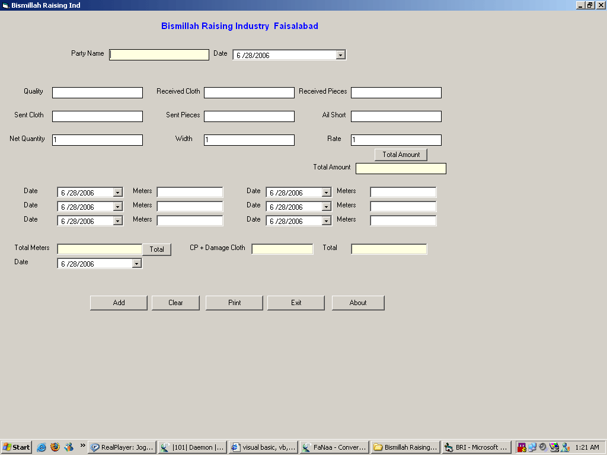



## Billing System v 1\.1\.0

### Description

I write this code for a clint who wants to make his bills print and save them. SO i made this. It is to easy + u can also print it and also save the bills. It is basically a Cloth Raising industry. So it is very fast way to make bills and make print. enjoy it :)
 
### More Info
 

             |
---                |---
**Submitted On**   |2006-06-29 16:08:08
**By**             |[M\.F\.Aziz](https://github.com/Planet-Source-Code/PSCIndex/blob/master/ByAuthor/m-f-aziz.md)
**Level**          |Intermediate
**User Rating**    |4.7 (14 globes from 3 users)
**Compatibility**  |VB 5\.0, VB 6\.0
**Category**       |[Complete Applications](https://github.com/Planet-Source-Code/PSCIndex/blob/master/ByCategory/complete-applications__1-27.md)
**World**          |[Visual Basic](https://github.com/Planet-Source-Code/PSCIndex/blob/master/ByWorld/visual-basic.md)
**Archive File**   |[Billing\_Sy200379712006\.zip](https://github.com/Planet-Source-Code/m-f-aziz-billing-system-v-1-1-0__1-65837/archive/master.zip)

